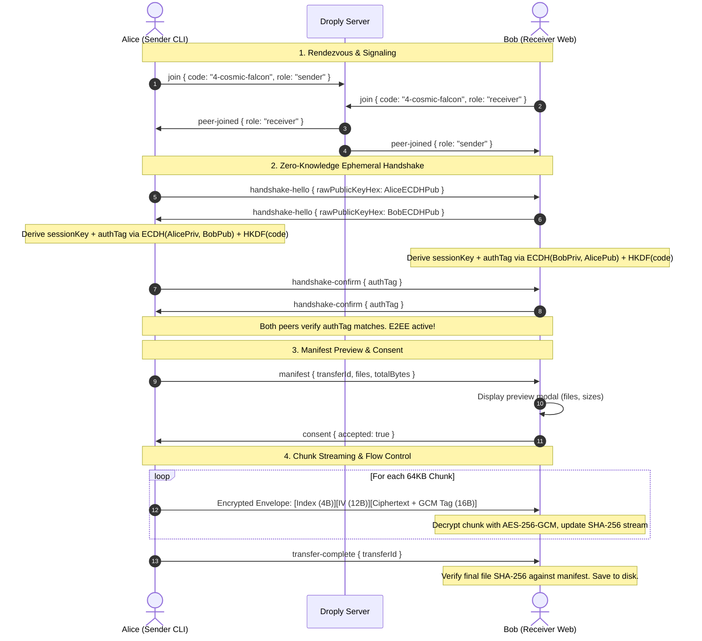

# Droply Architecture Specification

`droply` is a zero-knowledge, end-to-end encrypted peer-to-peer file transfer utility designed for full interoperability between terminal users and browser users.

---

## 1. System Topology

```mermaid
flowchart TD
    subgraph Signaling & Relay Server
        WS[WebSocket Room Coordinator]
        Relay[Zero-Knowledge Chunk Relay]
        HTTP[Static Web UI Host]
    end

    subgraph Peer A: Sender
        CLI_A[droply CLI]
        Crypto_A[ECDH + AES-256-GCM Engine]
    end

    subgraph Peer B: Receiver
        WEB_B[droply Web Client]
        Crypto_B[Web Crypto API Subsystem]
    end

    CLI_A -- 1. Signaling (Join / SDP / ICE) --> WS
    WEB_B -- 1. Signaling (Join / SDP / ICE) --> WS

    CLI_A <-. 2a. Direct WebRTC P2P (Preferred) .-> WEB_B
    CLI_A -- 2b. Encrypted Fallback Relay --> Relay --> WEB_B

    HTTP -. Serves SPA Web Assets .-> WEB_B
```

---

## 2. Transfer Lifecycle & Sequence Diagram



---

## 3. Wire Protocol & Packet Formats

### 3.1 Binary Encrypted Chunk Envelope
All file data is transferred as 64 KB encrypted chunks. Every chunk is authenticated with AES-256-GCM using Additional Authenticated Data (AAD):

```
+-------------------+------------------+-----------------------+-------------------+
| Chunk Index (4 B) |  IV / Nonce (12B)|  Ciphertext (VarLen)  | GCM Tag (16 Bytes)|
|  Big-Endian uint32|  Random per-chunk|  AES-256-GCM Encrypted|  Authentication   |
+-------------------+------------------+-----------------------+-------------------+
|<---------------- AAD --------------->|
```

- **Chunk Index (0..3)**: 32-bit unsigned integer in big-endian format. It is also fed into AES-GCM as Additional Authenticated Data (AAD) to prevent chunk reordering or omission attacks.
- **IV / Nonce (4..15)**: 12 cryptographically random bytes generated via `crypto.getRandomValues()`.
- **Ciphertext (16..end-16)**: Encrypted payload bytes.
- **GCM Auth Tag (last 16 bytes)**: Poly1305 / GCM authentication tag ensuring complete tamper resistance.

### 3.2 Manifest Schema
```typescript
interface Manifest {
  transferId: string;
  payloadType: 'file' | 'directory' | 'text';
  files: Array<{
    id: string;
    path: string;       // Relative path (e.g. "my-project/src/index.ts")
    size: number;       // Exact size in bytes
    mimeType?: string;  // MIME type detection
    sha256: string;     // Hex-encoded SHA-256 digest
  }>;
  totalBytes: number;
  textSnippet?: string;
}
```

---

## 4. NAT Traversal & Encrypted Relay Fallback

1. **Direct WebRTC P2P**: Droply connects peers using WebRTC DataChannels with public STUN servers (`stun:stun.l.google.com:19302`).
2. **Encrypted Relay Fallback**: If symmetric NAT or restrictive corporate firewalls block direct UDP hole-punching within 5 seconds, peers transparently route encrypted chunk envelopes through the signaling server's WebSocket relay.
3. **Zero Knowledge**: Because all payload chunks are encrypted client-side before touching the network, the relay server acts as an untrusted pipe with zero insight into the transmitted data.
